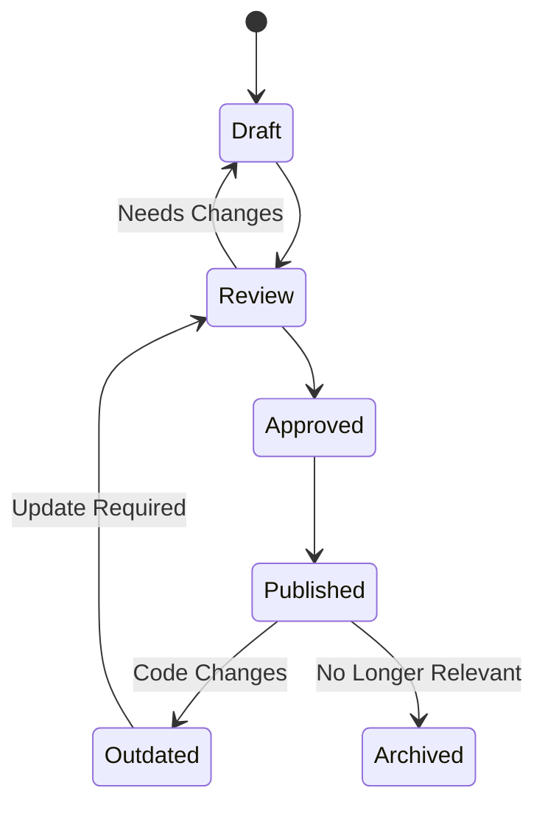
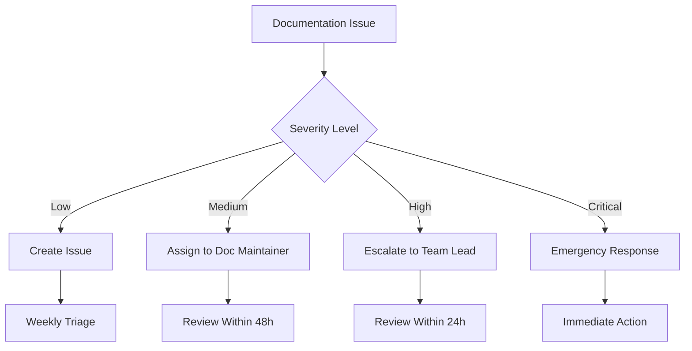

# BitChat Flutter - Documentation Maintenance Guide

**Version:** 1.0  
**Last Updated:** July 26, 2025

## Overview

This guide outlines the processes and responsibilities for maintaining high-quality, up-to-date documentation for BitChat Flutter. Proper documentation maintenance ensures that developers can effectively contribute to and use the project.

## Documentation Lifecycle

### 1. Documentation Types and Ownership

| Documentation Type | Owner | Update Frequency | Review Cycle |
|-------------------|-------|------------------|--------------|
| **API Documentation** | Code authors | With each code change | Every PR |
| **Architecture Docs** | Lead developers | Major changes only | Quarterly |
| **Protocol Specs** | Protocol team | Version changes | With protocol updates |
| **User Guides** | Documentation team | Feature releases | Monthly |
| **Setup Guides** | DevOps team | Environment changes | As needed |
| **Contributing Guides** | Maintainers | Process changes | Bi-annually |

### 2. Documentation States



## Maintenance Processes

### 1. Regular Maintenance Tasks

#### Daily Tasks (Automated)
- **Link Validation**: Check for broken internal and external links
- **Example Testing**: Verify code examples compile and run
- **Spelling/Grammar**: Automated spell checking
- **Format Validation**: Ensure consistent markdown formatting

```bash
# Daily automation script
#!/bin/bash
echo "Running daily documentation maintenance..."

# Check for broken links
markdown-link-check docs/**/*.md

# Validate code examples
dart doc --validate-links

# Spell check
cspell "docs/**/*.md" "*.md"

# Format check
prettier --check "docs/**/*.md" "*.md"
```

#### Weekly Tasks (Manual)
- **Content Review**: Review recently changed documentation
- **User Feedback**: Address documentation issues and questions
- **Metrics Review**: Analyze documentation usage and effectiveness
- **Cross-Reference Validation**: Ensure internal links are accurate

#### Monthly Tasks (Team)
- **Comprehensive Review**: Full documentation audit
- **User Experience Testing**: Test setup guides with fresh environments
- **Accessibility Check**: Ensure documentation is accessible
- **Performance Review**: Optimize documentation site performance

#### Quarterly Tasks (Strategic)
- **Architecture Review**: Update high-level architecture documentation
- **Process Improvement**: Refine documentation processes
- **Tool Evaluation**: Assess documentation tools and workflows
- **Training Updates**: Update team training materials

### 2. Change-Driven Maintenance

#### Code Changes
```yaml
# Documentation update triggers
code_changes:
  api_changes:
    - Update API documentation
    - Update code examples
    - Update integration guides
  
  protocol_changes:
    - Update protocol specification
    - Update compatibility matrices
    - Update security documentation
  
  architecture_changes:
    - Update architecture diagrams
    - Update component documentation
    - Update deployment guides
```

#### Process Changes
- **Workflow Updates**: Update development workflow documentation
- **Tool Changes**: Update setup and usage guides
- **Policy Changes**: Update contributing guidelines and standards

### 3. Quality Assurance

#### Documentation Review Checklist
```markdown
## Content Quality
- [ ] Information is accurate and up-to-date
- [ ] Examples work and are relevant
- [ ] Language is clear and concise
- [ ] Technical terms are properly defined
- [ ] Cross-references are accurate

## Structure and Format
- [ ] Follows established templates
- [ ] Headers and sections are logical
- [ ] Code blocks have proper syntax highlighting
- [ ] Links are working and relevant
- [ ] Images have alt text

## Completeness
- [ ] All public APIs are documented
- [ ] Security considerations are covered
- [ ] Performance implications are noted
- [ ] Platform differences are explained
- [ ] Related documentation is linked

## User Experience
- [ ] Information is easy to find
- [ ] Examples are practical and complete
- [ ] Prerequisites are clearly stated
- [ ] Next steps are provided
- [ ] Troubleshooting is included
```

## Documentation Standards Enforcement

### 1. Automated Checks

#### Pre-commit Hooks
```bash
# .pre-commit-config.yaml
repos:
  - repo: local
    hooks:
      - id: docs-format
        name: Format Documentation
        entry: prettier --write
        language: node
        files: \.(md|markdown)$
      
      - id: docs-spell-check
        name: Spell Check Documentation
        entry: cspell
        language: node
        files: \.(md|markdown)$
      
      - id: docs-link-check
        name: Check Documentation Links
        entry: markdown-link-check
        language: node
        files: \.(md|markdown)$
```

#### CI/CD Integration
```yaml
# .github/workflows/docs.yml
name: Documentation Quality

on:
  push:
    paths:
      - 'docs/**'
      - '*.md'
  pull_request:
    paths:
      - 'docs/**'
      - '*.md'

jobs:
  docs-quality:
    runs-on: ubuntu-latest
    steps:
      - uses: actions/checkout@v3
      
      - name: Check Links
        uses: gaurav-nelson/github-action-markdown-link-check@v1
        with:
          use-quiet-mode: 'yes'
          use-verbose-mode: 'yes'
      
      - name: Spell Check
        uses: streetsidesoftware/cspell-action@v2
        with:
          files: "docs/**/*.md *.md"
      
      - name: Validate Code Examples
        run: |
          # Extract and test code examples
          scripts/test-doc-examples.sh
```

### 2. Manual Review Process

#### Documentation PR Review
```markdown
## Documentation PR Checklist

### Content Review
- [ ] Technical accuracy verified
- [ ] Examples tested and working
- [ ] Security implications considered
- [ ] Compatibility notes updated

### Style Review
- [ ] Follows style guide
- [ ] Consistent terminology used
- [ ] Proper grammar and spelling
- [ ] Appropriate tone and voice

### Structure Review
- [ ] Logical organization
- [ ] Proper heading hierarchy
- [ ] Effective use of formatting
- [ ] Good cross-referencing

### User Experience Review
- [ ] Clear and actionable
- [ ] Appropriate level of detail
- [ ] Good examples and illustrations
- [ ] Helpful troubleshooting
```

## Documentation Metrics and Analytics

### 1. Key Performance Indicators

#### Usage Metrics
- **Page Views**: Most and least accessed documentation
- **Search Queries**: What users are looking for
- **Time on Page**: How long users spend reading
- **Bounce Rate**: How often users leave immediately

#### Quality Metrics
- **Issue Reports**: Documentation-related bug reports
- **Contribution Rate**: How often docs are updated
- **Review Feedback**: Quality of review comments
- **User Satisfaction**: Surveys and feedback scores

#### Maintenance Metrics
- **Update Frequency**: How often docs are updated
- **Staleness**: How long since last update
- **Coverage**: Percentage of code with documentation
- **Consistency**: Adherence to style guidelines

### 2. Monitoring and Reporting

#### Weekly Reports
```markdown
# Documentation Health Report - Week of [Date]

## Summary
- Pages updated: X
- Issues resolved: Y
- New documentation: Z

## Quality Metrics
- Broken links found/fixed: X/Y
- Spelling errors found/fixed: X/Y
- Code examples tested: X (Y failed)

## User Feedback
- Positive feedback: X items
- Issues reported: Y items
- Feature requests: Z items

## Action Items
- [ ] Update outdated protocol documentation
- [ ] Fix broken links in setup guide
- [ ] Add missing API documentation
```

#### Monthly Dashboard
- Documentation coverage percentage
- User satisfaction scores
- Most requested documentation
- Documentation maintenance velocity

## Tools and Automation

### 1. Documentation Tools Stack

#### Core Tools
- **Markdown**: Primary documentation format
- **dartdoc**: API documentation generation
- **MkDocs/GitBook**: Documentation site generation
- **Mermaid**: Diagram generation
- **PlantUML**: Architecture diagrams

#### Quality Tools
- **Prettier**: Markdown formatting
- **CSpell**: Spell checking
- **markdown-link-check**: Link validation
- **Vale**: Style and tone checking
- **textlint**: Grammar and style linting

#### Automation Tools
- **GitHub Actions**: CI/CD for documentation
- **Dependabot**: Keep documentation dependencies updated
- **Renovate**: Automated dependency updates
- **Zapier/IFTTT**: Workflow automation

### 2. Custom Automation Scripts

#### Documentation Health Check
```bash
#!/bin/bash
# scripts/doc-health-check.sh

echo "🔍 Running documentation health check..."

# Check for outdated documentation
find docs -name "*.md" -mtime +90 -exec echo "⚠️  Outdated: {}" \;

# Check for missing API documentation
dart doc --dry-run 2>&1 | grep "warning: no doc comment" | wc -l

# Check for broken internal links
markdown-link-check docs/**/*.md --quiet

# Check for TODO items in documentation
grep -r "TODO\|FIXME\|TBD" docs/ | wc -l

echo "✅ Health check complete!"
```

#### Example Testing Script
```bash
#!/bin/bash
# scripts/test-doc-examples.sh

echo "🧪 Testing documentation examples..."

# Extract code blocks from markdown files
for file in docs/**/*.md *.md; do
  echo "Testing examples in $file..."
  
  # Extract Dart code blocks
  awk '/```dart/,/```/' "$file" | grep -v '```' > temp_example.dart
  
  if [ -s temp_example.dart ]; then
    # Test if code compiles
    dart analyze temp_example.dart
    if [ $? -ne 0 ]; then
      echo "❌ Example in $file failed to compile"
    else
      echo "✅ Example in $file compiled successfully"
    fi
  fi
  
  rm -f temp_example.dart
done
```

## Team Responsibilities

### 1. Role Definitions

#### Documentation Maintainer
- **Primary Responsibility**: Overall documentation quality and consistency
- **Tasks**: Review documentation PRs, maintain style guides, coordinate updates
- **Skills**: Technical writing, project knowledge, attention to detail

#### Code Authors
- **Primary Responsibility**: API and implementation documentation
- **Tasks**: Document new code, update docs with code changes
- **Skills**: Domain expertise, technical writing basics

#### Technical Writers
- **Primary Responsibility**: User-facing documentation and guides
- **Tasks**: Write tutorials, improve readability, user experience testing
- **Skills**: Technical writing, user experience, communication

#### DevOps Engineers
- **Primary Responsibility**: Documentation infrastructure and automation
- **Tasks**: Maintain documentation tools, automate quality checks
- **Skills**: Automation, tooling, infrastructure management

### 2. Escalation Process



#### Severity Levels
- **Critical**: Documentation errors that could cause security issues or data loss
- **High**: Incorrect information that could cause significant problems
- **Medium**: Missing or outdated information affecting user experience
- **Low**: Minor improvements, typos, formatting issues

## Documentation Migration and Archival

### 1. Migration Process

#### When to Migrate
- Major version releases
- Significant architecture changes
- Tool or platform changes
- Rebranding or reorganization

#### Migration Steps
1. **Assessment**: Evaluate current documentation state
2. **Planning**: Create migration timeline and resource allocation
3. **Content Audit**: Identify what to keep, update, or remove
4. **Migration**: Move and update content systematically
5. **Validation**: Test all links, examples, and references
6. **Deployment**: Publish migrated documentation
7. **Cleanup**: Archive or remove old documentation

### 2. Archival Process

#### Archival Criteria
- Documentation for deprecated features
- Outdated process documentation
- Superseded technical specifications
- Historical versions no longer supported

#### Archival Steps
1. **Mark as Deprecated**: Add deprecation notices
2. **Redirect Setup**: Set up redirects to new documentation
3. **Archive Location**: Move to archive section
4. **Metadata Update**: Add archival date and reason
5. **Search Exclusion**: Remove from search indexes

## Continuous Improvement

### 1. Feedback Collection

#### User Feedback Channels
- **GitHub Issues**: Bug reports and feature requests
- **Documentation Comments**: Inline feedback system
- **Surveys**: Periodic user satisfaction surveys
- **Analytics**: Usage patterns and behavior analysis

#### Internal Feedback
- **Team Retrospectives**: Regular team feedback sessions
- **Code Reviews**: Documentation feedback in PR reviews
- **Onboarding Feedback**: New team member experiences
- **Support Tickets**: Common documentation-related issues

### 2. Process Optimization

#### Regular Process Reviews
- **Monthly**: Review metrics and adjust processes
- **Quarterly**: Evaluate tools and workflows
- **Annually**: Comprehensive process overhaul

#### Improvement Implementation
1. **Identify Issues**: Collect and analyze feedback
2. **Propose Solutions**: Develop improvement proposals
3. **Test Changes**: Pilot improvements with small scope
4. **Measure Impact**: Evaluate effectiveness of changes
5. **Scale Success**: Implement successful improvements broadly

## Conclusion

Effective documentation maintenance requires:

- **Systematic Processes**: Regular, predictable maintenance activities
- **Clear Ownership**: Defined roles and responsibilities
- **Quality Standards**: Consistent application of documentation standards
- **Automation**: Tools to reduce manual effort and ensure consistency
- **Continuous Improvement**: Regular evaluation and optimization

By following this maintenance guide, we ensure that BitChat Flutter documentation remains accurate, useful, and accessible to all stakeholders.

---

**Remember**: Good documentation is a living asset that requires ongoing investment and care. The effort put into maintenance pays dividends in developer productivity, user satisfaction, and project success.

**Questions?** Contact the documentation team or create an issue for clarification on maintenance processes.