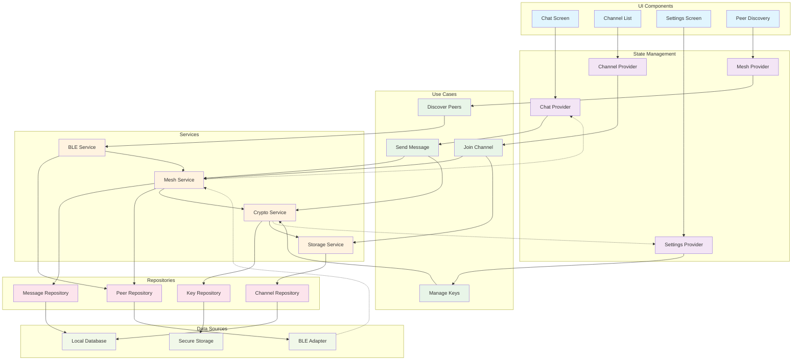

# BitChat Flutter - Component Interactions

## Component Interaction Patterns

### Request Flow (Solid Lines)
1. **UI Components** trigger actions through **State Providers**
2. **Providers** coordinate **Use Cases** to handle business logic
3. **Use Cases** orchestrate **Services** to perform operations
4. **Services** use **Repositories** to access data
5. **Repositories** interact with **Data Sources** for persistence/communication

### Notification Flow (Dashed Lines)
- **BLE Adapter** notifies **Mesh Service** of incoming data
- **Mesh Service** notifies **Chat Provider** of new messages
- **Crypto Service** notifies **Settings Provider** of key events

### Key Interactions

#### Message Sending Flow
1. User types message in **Chat Screen**
2. **Chat Provider** calls **Send Message** use case
3. Use case coordinates **Mesh Service** and **Crypto Service**
4. Message is encrypted and transmitted via **BLE Service**
5. Message is stored locally via **Message Repository**

#### Channel Joining Flow
1. User selects channel in **Channel List**
2. **Channel Provider** calls **Join Channel** use case
3. Use case uses **Mesh Service** to announce join
4. Channel data is persisted via **Storage Service**

#### Peer Discovery Flow
1. **Peer Discovery** screen triggers discovery
2. **Mesh Provider** calls **Discover Peers** use case
3. Use case activates **BLE Service** scanning
4. Discovered peers are cached via **Peer Repository**

### Design Patterns Used
- **Provider Pattern**: State management and UI updates
- **Repository Pattern**: Data access abstraction
- **Use Case Pattern**: Business logic encapsulation
- **Observer Pattern**: Event notifications and updates