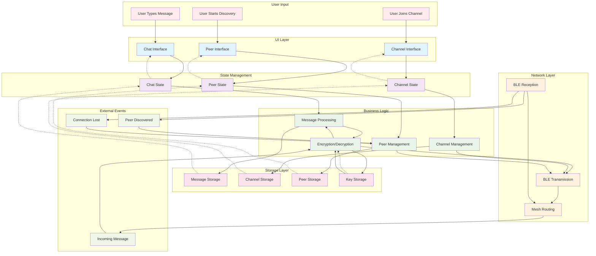

# BitChat Flutter - Data Flow



## Data Flow Patterns

### Primary Data Flows

#### 1. Outgoing Message Flow
```
User Input → UI → State → Business Logic → Encryption → Network → Mesh Routing
                                      ↓
                                   Storage
```

#### 2. Incoming Message Flow
```
Network Reception → Mesh Routing → Decryption → Business Logic → State → UI
                                                      ↓
                                                  Storage
```

#### 3. Peer Discovery Flow
```
User Action → UI → State → Peer Management → Network Scanning
                                    ↓
                                 Storage
                                    ↓
                            State Update → UI
```

### Data Types and Transformations

#### Message Data Flow
1. **User Input**: Plain text message
2. **UI Layer**: Formatted message with metadata
3. **State Layer**: Message object with channel context
4. **Business Logic**: Validated message with routing info
5. **Encryption**: Encrypted binary payload
6. **Network**: BLE packet with mesh headers
7. **Storage**: Persisted message record

#### Channel Data Flow
1. **User Input**: Channel name/password
2. **UI Layer**: Channel join request
3. **State Layer**: Channel state update
4. **Business Logic**: Channel validation and key derivation
5. **Network**: Channel announcement packet
6. **Storage**: Channel membership record

#### Peer Data Flow
1. **Network Input**: BLE advertisement
2. **Business Logic**: Peer validation and capability detection
3. **State Layer**: Peer list update
4. **Storage**: Peer cache record
5. **UI Layer**: Peer list display

### State Synchronization

#### Reactive Updates (Dashed Lines)
- **Storage → State**: Data loading on app start
- **State → UI**: Reactive UI updates via Provider pattern
- **Network → State**: Real-time updates from mesh network

#### Bidirectional Flows
- **Encryption ↔ Key Storage**: Key generation, storage, and retrieval
- **State ↔ Storage**: Data persistence and loading
- **Business Logic ↔ Network**: Send/receive operations

### Error Handling Flows
- Network failures trigger retry mechanisms
- Encryption failures trigger key renegotiation
- Storage failures trigger cache rebuilding
- UI errors trigger user notifications

### Performance Optimizations
- **Lazy Loading**: UI components load data on demand
- **Caching**: Frequently accessed data cached in memory
- **Batching**: Multiple operations batched for efficiency
- **Background Processing**: Heavy operations run off main thread