# BitChat Flutter - Flutter-Specific Architecture

```mermaid
graph TB
    subgraph "Flutter Framework"
        WIDGETS[Widget Tree]
        RENDER[Render Tree]
        ELEMENT[Element Tree]
    end
    
    subgraph "State Management (Provider)"
        CHANGE_NOTIFIER[ChangeNotifier]
        CONSUMER[Consumer Widgets]
        PROVIDER[Provider Widgets]
        SELECTOR[Selector Widgets]
    end
    
    subgraph "Navigation"
        ROUTER[GoRouter]
        ROUTES[Route Definitions]
        GUARDS[Route Guards]
        TRANSITIONS[Page Transitions]
    end
    
    subgraph "Feature Modules"
        CHAT_MODULE[Chat Module]
        CHANNEL_MODULE[Channel Module]
        MESH_MODULE[Mesh Module]
        SETTINGS_MODULE[Settings Module]
    end
    
    subgraph "Shared Components"
        CUSTOM_WIDGETS[Custom Widgets]
        THEMES[Material Theme]
        EXTENSIONS[Dart Extensions]
        UTILS[Utility Functions]
    end
    
    subgraph "Platform Channels"
        METHOD_CHANNEL[Method Channels]
        EVENT_CHANNEL[Event Channels]
        PLATFORM_VIEWS[Platform Views]
    end
    
    subgraph "Native Platform"
        ANDROID_NATIVE[Android Native Code]
        IOS_NATIVE[iOS Native Code]
        DESKTOP_NATIVE[Desktop Native Code]
    end
    
    subgraph "External Packages"
        FLUTTER_BLUE[flutter_blue_plus]
        HIVE[Hive Database]
        CRYPTO_PKG[crypto Package]
        PERMISSION[permission_handler]
    end
    
    subgraph "Background Services"
        ISOLATES[Dart Isolates]
        BACKGROUND_TASKS[Background Tasks]
        TIMERS[Periodic Timers]
    end
    
    %% Widget Tree Flow
    WIDGETS --> RENDER
    RENDER --> ELEMENT
    
    %% State Management Flow
    CHANGE_NOTIFIER --> PROVIDER
    PROVIDER --> CONSUMER
    CONSUMER --> WIDGETS
    SELECTOR --> WIDGETS
    
    %% Navigation Flow
    ROUTER --> ROUTES
    ROUTES --> GUARDS
    GUARDS --> TRANSITIONS
    TRANSITIONS --> WIDGETS
    
    %% Feature Module Integration
    CHAT_MODULE --> CHANGE_NOTIFIER
    CHANNEL_MODULE --> CHANGE_NOTIFIER
    MESH_MODULE --> CHANGE_NOTIFIER
    SETTINGS_MODULE --> CHANGE_NOTIFIER
    
    %% Shared Components Integration
    CUSTOM_WIDGETS --> WIDGETS
    THEMES --> WIDGETS
    EXTENSIONS --> CHAT_MODULE
    UTILS --> CHANNEL_MODULE
    
    %% Platform Channel Communication
    MESH_MODULE --> METHOD_CHANNEL
    METHOD_CHANNEL --> ANDROID_NATIVE
    METHOD_CHANNEL --> IOS_NATIVE
    METHOD_CHANNEL --> DESKTOP_NATIVE
    
    EVENT_CHANNEL --> MESH_MODULE
    ANDROID_NATIVE --> EVENT_CHANNEL
    IOS_NATIVE --> EVENT_CHANNEL
    
    %% External Package Integration
    FLUTTER_BLUE --> MESH_MODULE
    HIVE --> CHAT_MODULE
    CRYPTO_PKG --> MESH_MODULE
    PERMISSION --> SETTINGS_MODULE
    
    %% Background Processing
    MESH_MODULE --> ISOLATES
    ISOLATES --> BACKGROUND_TASKS
    BACKGROUND_TASKS --> TIMERS
    
    %% Cross-cutting Concerns
    THEMES --> CUSTOM_WIDGETS
    EXTENSIONS --> UTILS
    ROUTER --> FEATURE_MODULES[All Feature Modules]
    
    classDef flutter fill:#e1f5fe
    classDef state fill:#f3e5f5
    classDef navigation fill:#e8f5e8
    classDef features fill:#fff3e0
    classDef shared fill:#fce4ec
    classDef platform fill:#f1f8e9
    classDef native fill:#ffebee
    classDef packages fill:#f9fbe7
    classDef background fill:#fafafa
    
    class WIDGETS,RENDER,ELEMENT flutter
    class CHANGE_NOTIFIER,CONSUMER,PROVIDER,SELECTOR state
    class ROUTER,ROUTES,GUARDS,TRANSITIONS navigation
    class CHAT_MODULE,CHANNEL_MODULE,MESH_MODULE,SETTINGS_MODULE features
    class CUSTOM_WIDGETS,THEMES,EXTENSIONS,UTILS shared
    class METHOD_CHANNEL,EVENT_CHANNEL,PLATFORM_VIEWS platform
    class ANDROID_NATIVE,IOS_NATIVE,DESKTOP_NATIVE native
    class FLUTTER_BLUE,HIVE,CRYPTO_PKG,PERMISSION packages
    class ISOLATES,BACKGROUND_TASKS,TIMERS background
```



## Flutter-Specific Architecture Details

### Widget Architecture

#### Widget Tree Structure
```dart
MaterialApp
├── GoRouter (Navigation)
├── MultiProvider (State Management)
│   ├── ChatProvider
│   ├── ChannelProvider
│   ├── MeshProvider
│   └── SettingsProvider
└── Scaffold-based Screens
    ├── ChatScreen
    ├── ChannelListScreen
    ├── SettingsScreen
    └── PeerDiscoveryScreen
```

#### State Management Pattern
- **ChangeNotifier**: Base class for all state providers
- **Provider**: Dependency injection and state provision
- **Consumer**: Reactive UI updates
- **Selector**: Optimized partial state listening

### Navigation Architecture

#### Route Structure
```dart
GoRouter(
  routes: [
    GoRoute(path: '/', builder: (context, state) => ChatScreen()),
    GoRoute(path: '/channels', builder: (context, state) => ChannelListScreen()),
    GoRoute(path: '/settings', builder: (context, state) => SettingsScreen()),
    GoRoute(path: '/peers', builder: (context, state) => PeerDiscoveryScreen()),
  ],
  redirect: (context, state) => authGuard(context, state),
)
```

### Feature Module Structure

Each feature module follows this pattern:
```
feature_name/
├── presentation/
│   ├── providers/          # ChangeNotifier implementations
│   ├── screens/           # Full-screen widgets
│   └── widgets/           # Feature-specific widgets
├── domain/
│   ├── entities/          # Data models
│   ├── repositories/      # Abstract interfaces
│   └── use_cases/         # Business logic
└── data/
    ├── models/            # JSON serializable models
    ├── repositories/      # Repository implementations
    └── data_sources/      # Local/remote data sources
```

### Platform Integration

#### Method Channels
```dart
class BluetoothMethodChannel {
  static const MethodChannel _channel = MethodChannel('bitchat/bluetooth');
  
  Future<void> startScanning() async {
    await _channel.invokeMethod('startScanning');
  }
}
```

#### Event Channels
```dart
class BluetoothEventChannel {
  static const EventChannel _channel = EventChannel('bitchat/bluetooth_events');
  
  Stream<BluetoothEvent> get events => _channel.receiveBroadcastStream();
}
```

### Background Processing

#### Isolate Usage
```dart
class MeshNetworkIsolate {
  static Future<void> processMessages(List<Message> messages) async {
    await Isolate.spawn(_processInBackground, messages);
  }
  
  static void _processInBackground(List<Message> messages) {
    // Heavy processing without blocking UI
  }
}
```

### Package Integration

#### flutter_blue_plus Integration
```dart
class BluetoothService {
  final FlutterBluePlus _bluetooth = FlutterBluePlus.instance;
  
  Stream<ScanResult> startScan() {
    return _bluetooth.scan(timeout: Duration(seconds: 10));
  }
}
```

#### Hive Database Integration
```dart
@HiveType(typeId: 0)
class Message extends HiveObject {
  @HiveField(0)
  String content;
  
  @HiveField(1)
  DateTime timestamp;
}
```

### Performance Optimizations

#### Widget Optimization
- **const constructors**: Immutable widgets for better performance
- **Selector widgets**: Prevent unnecessary rebuilds
- **ListView.builder**: Lazy loading for large lists
- **RepaintBoundary**: Isolate expensive repaints

#### Memory Management
- **Dispose patterns**: Proper cleanup of resources
- **Weak references**: Prevent memory leaks
- **Stream subscriptions**: Proper cancellation
- **Image caching**: Efficient image memory usage

### Testing Architecture

#### Widget Testing
```dart
testWidgets('Chat screen displays messages', (WidgetTester tester) async {
  await tester.pumpWidget(
    MultiProvider(
      providers: [ChangeNotifierProvider(create: (_) => MockChatProvider())],
      child: ChatScreen(),
    ),
  );
  
  expect(find.text('Hello World'), findsOneWidget);
});
```

#### Integration Testing
```dart
void main() {
  group('BitChat Integration Tests', () {
    testWidgets('Complete message flow', (WidgetTester tester) async {
      // Test complete user journey
    });
  });
}
```

This Flutter-specific architecture ensures optimal performance, maintainability, and platform integration while following Flutter best practices and design patterns.