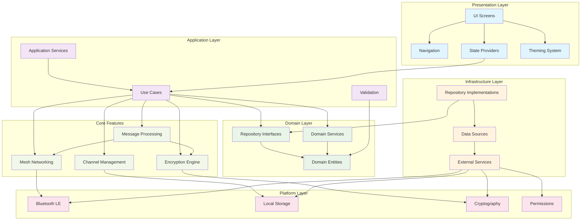

# BitChat Flutter - System Architecture

## Architecture Overview

This diagram shows the high-level system architecture of BitChat Flutter following Clean Architecture principles:

### Layers (Top to Bottom)
1. **Presentation Layer**: UI components, navigation, state management, and theming
2. **Application Layer**: Use cases, application services, and validation logic
3. **Domain Layer**: Core business entities, repository interfaces, and domain services
4. **Infrastructure Layer**: Repository implementations, data sources, and external service adapters
5. **Platform Layer**: Platform-specific implementations (Bluetooth, storage, crypto, permissions)

### Core Features (Cross-cutting)
- **Mesh Networking**: Bluetooth LE mesh network management
- **Encryption Engine**: End-to-end encryption and key management
- **Channel Management**: Channel creation, joining, and moderation
- **Message Processing**: Message routing, storage, and delivery

### Key Principles
- **Dependency Inversion**: Higher layers depend on abstractions, not implementations
- **Separation of Concerns**: Each layer has a single responsibility
- **Testability**: Business logic is isolated from platform dependencies
- **Maintainability**: Clear boundaries between different aspects of the system