# BitChat Protocol - Encryption Flow

```mermaid
graph TB
    subgraph "Key Generation"
        SEED[Random Seed<br/>32 bytes]
        PRIV_KEY[Private Key<br/>X25519/Ed25519]
        PUB_KEY[Public Key<br/>X25519/Ed25519]
        
        SEED --> PRIV_KEY
        PRIV_KEY --> PUB_KEY
    end
    
    subgraph "Key Exchange (X25519 ECDH)"
        ALICE_PRIV[Alice Private Key]
        ALICE_PUB[Alice Public Key]
        BOB_PRIV[Bob Private Key]
        BOB_PUB[Bob Public Key]
        SHARED_SECRET[Shared Secret<br/>32 bytes]
        
        ALICE_PRIV --> SHARED_SECRET
        BOB_PUB --> SHARED_SECRET
        BOB_PRIV --> SHARED_SECRET
        ALICE_PUB --> SHARED_SECRET
    end
    
    subgraph "Key Derivation (HKDF)"
        SHARED_SECRET --> HKDF[HKDF-SHA256]
        SALT[Salt<br/>Random 32 bytes]
        INFO[Context Info<br/>"BitChat-v1"]
        
        SALT --> HKDF
        INFO --> HKDF
        HKDF --> ENC_KEY[Encryption Key<br/>32 bytes]
        HKDF --> MAC_KEY[MAC Key<br/>32 bytes]
    end
    
    subgraph "Message Encryption (AES-256-GCM)"
        PLAINTEXT[Plaintext Message]
        NONCE[Nonce<br/>12 bytes]
        ENC_KEY --> AES_GCM[AES-256-GCM]
        PLAINTEXT --> AES_GCM
        NONCE --> AES_GCM
        
        AES_GCM --> CIPHERTEXT[Ciphertext]
        AES_GCM --> AUTH_TAG[Auth Tag<br/>16 bytes]
    end
    
    subgraph "Digital Signature (Ed25519)"
        MESSAGE_HASH[Message Hash<br/>SHA-256]
        SIGN_PRIV[Signing Private Key<br/>Ed25519]
        
        CIPHERTEXT --> MESSAGE_HASH
        MESSAGE_HASH --> SIGNATURE[Digital Signature<br/>64 bytes]
        SIGN_PRIV --> SIGNATURE
    end
    
    subgraph "Channel Encryption"
        CHANNEL_PASS[Channel Password]
        ARGON2[Argon2id KDF]
        CHANNEL_KEY[Channel Key<br/>32 bytes]
        
        CHANNEL_PASS --> ARGON2
        ARGON2 --> CHANNEL_KEY
        CHANNEL_KEY --> AES_GCM
    end
    
    classDef keygen fill:#e1f5fe
    classDef exchange fill:#f3e5f5
    classDef derivation fill:#e8f5e8
    classDef encryption fill:#fff3e0
    classDef signature fill:#fce4ec
    classDef channel fill:#f1f8e9
    
    class SEED,PRIV_KEY,PUB_KEY keygen
    class ALICE_PRIV,ALICE_PUB,BOB_PRIV,BOB_PUB,SHARED_SECRET exchange
    class HKDF,SALT,INFO,ENC_KEY,MAC_KEY derivation
    class PLAINTEXT,NONCE,AES_GCM,CIPHERTEXT,AUTH_TAG encryption
    class MESSAGE_HASH,SIGN_PRIV,SIGNATURE signature
    class CHANNEL_PASS,ARGON2,CHANNEL_KEY channel
```

## Encryption Flow Details

### Cryptographic Primitives

#### Key Generation
```
Random Seed (32 bytes) → Private Key → Public Key
```
- **X25519**: Elliptic curve Diffie-Hellman key exchange
- **Ed25519**: Digital signatures and authentication
- **Secure Random**: OS-provided cryptographically secure random number generator

#### Key Exchange Protocol


### Key Derivation

#### HKDF (HMAC-based Key Derivation Function)
```
Input:
  - Shared Secret (32 bytes)
  - Salt (32 bytes random)
  - Info ("BitChat-v1-" + context)

Output:
  - Encryption Key (32 bytes)
  - MAC Key (32 bytes)
  - Additional keys as needed
```

#### Key Hierarchy


### Message Encryption Process

#### Direct Message Encryption


#### Channel Message Encryption


### Decryption Process

#### Message Decryption Flow


### Forward Secrecy

#### Session Key Rotation

```mermaid
graph TB
    subgraph "Session 1"
        KEY1[Session Key 1]
        MSG1[Messages 1-100]
        KEY1 --> MSG1
    end
    
    subgraph "Session 2"
        KEY2[Session Key 2]
        MSG2[Messages 101-200]
        KEY2 --> MSG2
    end
    
    subgraph "Session 3"
        KEY3[Session Key 3]
        MSG3[Messages 201-300]
        KEY3 --> MSG3
    end
    
    KEY1 -.->|Derive| KEY2
    KEY2 -.->|Derive| KEY3
    
    KEY1 -->|Delete| DELETED1[🗑️]
    KEY2 -->|Delete| DELETED2[🗑️]
    
    classDef session fill:#4caf50
    classDef deleted fill:#f44336
    
    class KEY1,KEY2,KEY3,MSG1,MSG2,MSG3 session
    class DELETED1,DELETED2 deleted
```


### Security Properties

#### Cryptographic Guarantees
- **Confidentiality**: AES-256-GCM encryption
- **Integrity**: GMAC authentication tags
- **Authenticity**: Ed25519 digital signatures
- **Forward Secrecy**: Ephemeral key exchange
- **Replay Protection**: Nonce and sequence numbers

#### Attack Resistance


### Performance Considerations

#### Encryption Performance
- **AES-256-GCM**: Hardware acceleration on modern devices
- **X25519**: Fast elliptic curve operations
- **Ed25519**: Efficient signature generation/verification
- **Argon2id**: Tunable parameters for password derivation

#### Memory Management
- **Key Zeroization**: Secure deletion of cryptographic material
- **Constant-Time Operations**: Prevent timing attacks
- **Secure Random**: Entropy pool management
- **Cache Resistance**: Avoid cryptographic key caching

This encryption flow ensures end-to-end security while maintaining high performance and resistance to various cryptographic attacks.