# BitChat Protocol - Mesh Network Topology

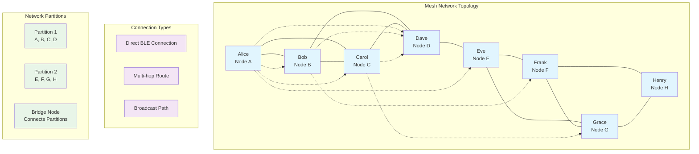

## Mesh Network Architecture

### Network Topology Patterns

#### 1. Star Topology (Limited Range)
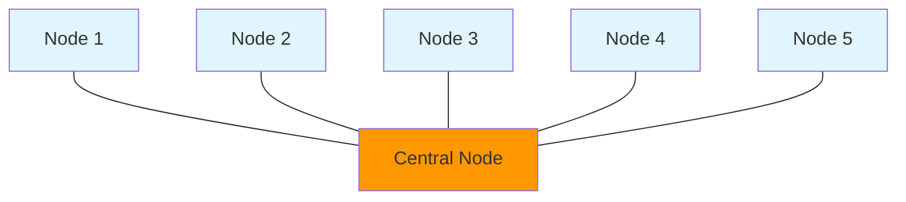

#### 2. Mesh Topology (Optimal)
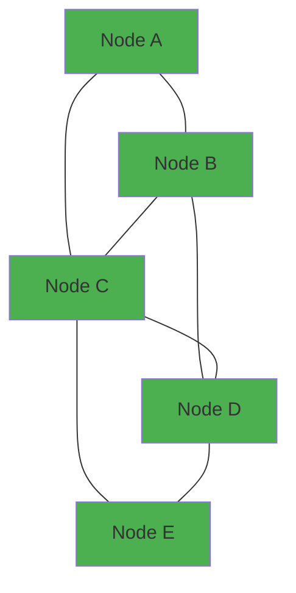

#### 3. Linear Topology (Extended Range)
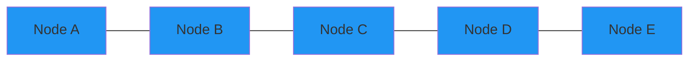

### Routing Algorithms

#### Distance Vector Routing
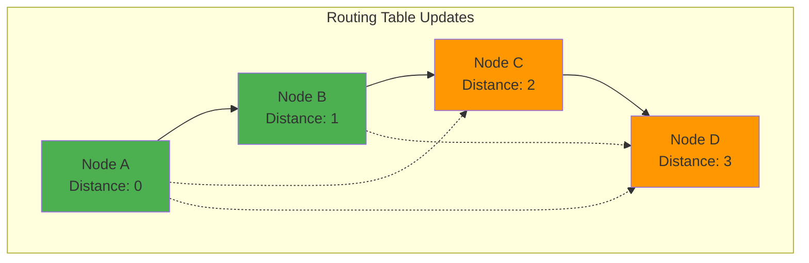

#### Shortest Path Selection
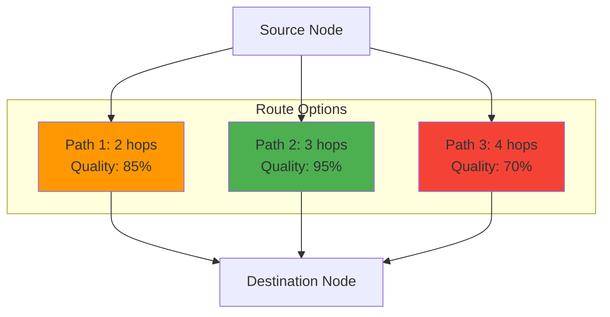

### Network Partitioning

#### Partition Detection
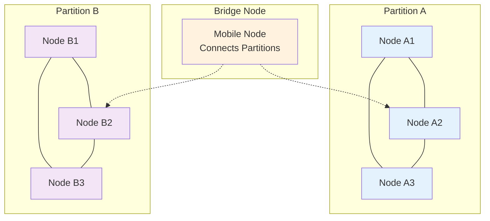

#### Store and Forward
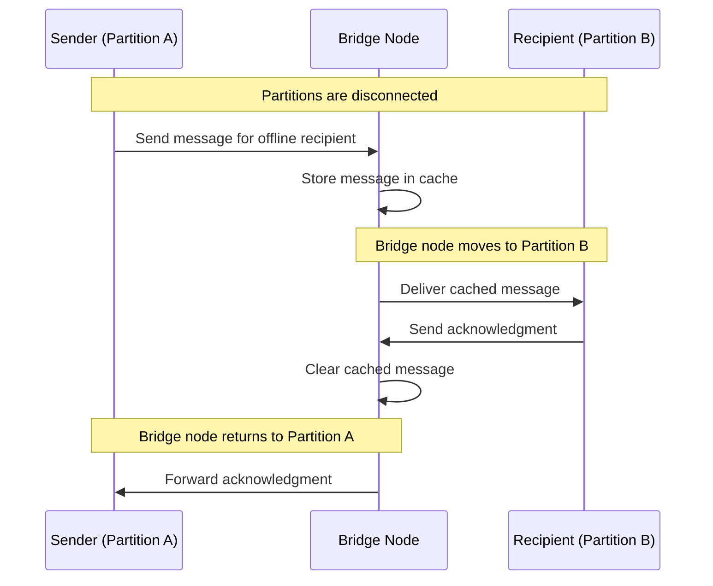

### Network Discovery

#### Peer Discovery Process
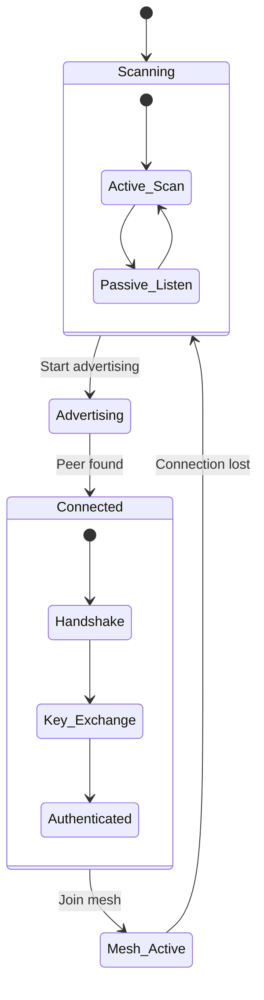

#### Network Maintenance
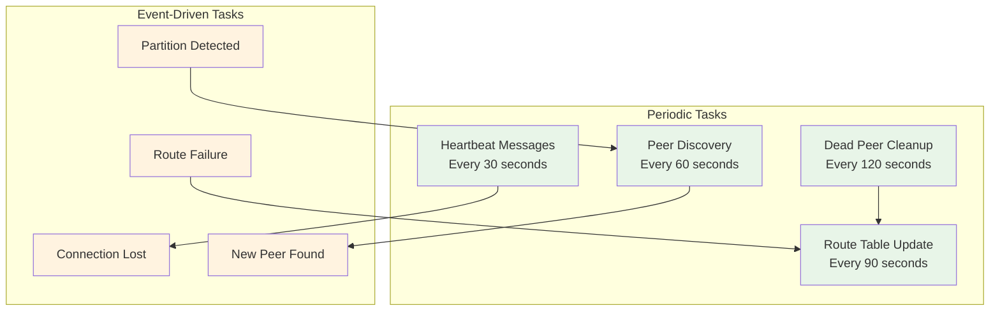

### Quality of Service

#### Connection Quality Metrics
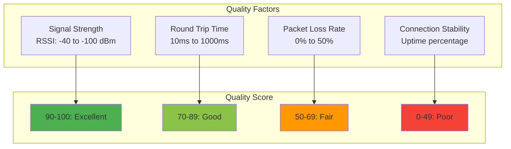

#### Adaptive Routing
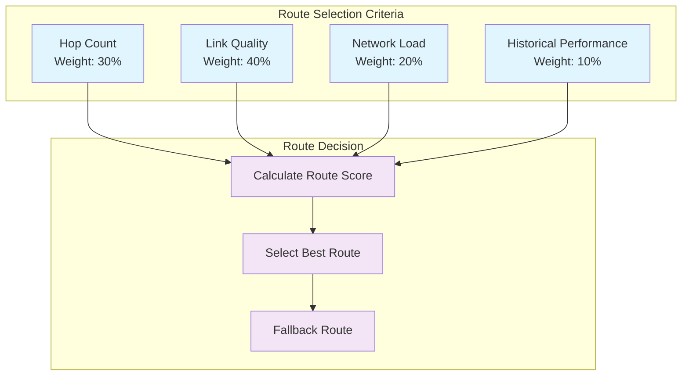

### Security Considerations

#### Network-Level Security
- **Node Authentication**: Ed25519 signatures for node identity
- **Route Verification**: Cryptographic proof of route integrity
- **Replay Protection**: Sequence numbers and timestamps
- **Sybil Attack Prevention**: Proof-of-work for node registration

#### Traffic Analysis Resistance
- **Message Padding**: Fixed-size packets to hide content length
- **Dummy Traffic**: Random messages to obscure communication patterns
- **Route Randomization**: Multiple paths for the same destination
- **Timing Obfuscation**: Random delays to hide traffic patterns

This mesh topology design ensures robust, scalable, and secure peer-to-peer communication while adapting to dynamic network conditions and maintaining optimal performance.