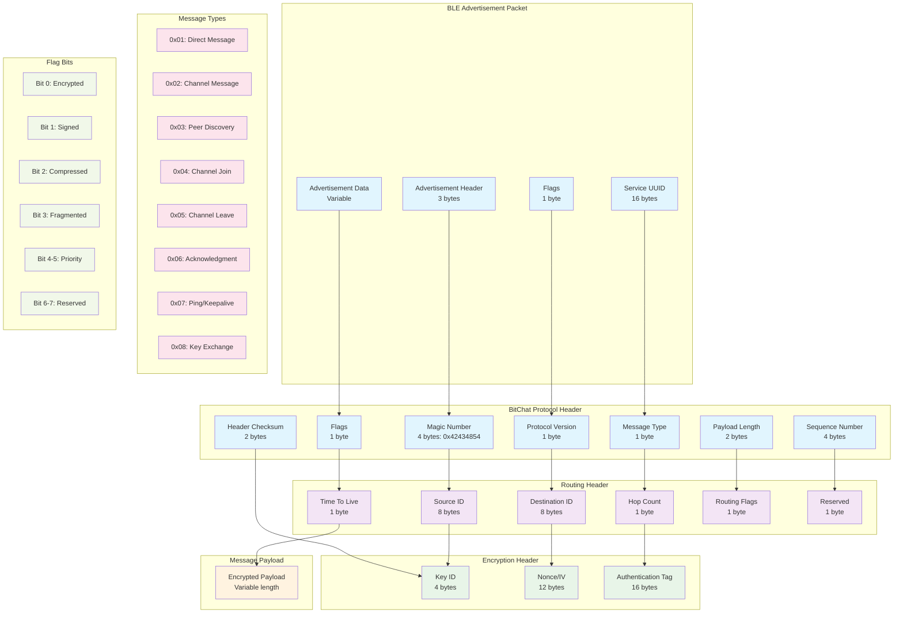

# BitChat Protocol - Packet Structure



## Packet Structure Details

### Complete Packet Layout

```
┌─────────────────────────────────────────────────────────────┐
│                    BLE Advertisement                        │
├─────────────────────────────────────────────────────────────┤
│                  BitChat Protocol Header                    │
├─────────────────────────────────────────────────────────────┤
│                     Routing Header                          │
├─────────────────────────────────────────────────────────────┤
│                   Encryption Header                         │
├─────────────────────────────────────────────────────────────┤
│                   Encrypted Payload                         │
└─────────────────────────────────────────────────────────────┘
```

### Header Field Descriptions

#### BitChat Protocol Header (16 bytes)
- **Magic Number**: `0x42434854` ("BCHT" in ASCII) - Protocol identification
- **Version**: Protocol version (current: 0x01)
- **Message Type**: See message types table below
- **Flags**: Bit field for message properties
- **Length**: Total payload length in bytes
- **Sequence Number**: Monotonic sequence for duplicate detection
- **Checksum**: CRC16 of header fields

#### Routing Header (20 bytes)
- **Source ID**: 64-bit sender identifier (derived from public key)
- **Destination ID**: 64-bit recipient identifier (0x00 for broadcast)
- **Hop Count**: Number of hops traversed (max 15)
- **TTL**: Time to live in seconds (max 255)
- **Routing Flags**: Routing-specific flags
- **Reserved**: Reserved for future use

#### Encryption Header (32 bytes)
- **Key ID**: Identifier for encryption key used
- **Nonce**: 96-bit nonce for AES-GCM
- **Auth Tag**: 128-bit authentication tag from AES-GCM

### Message Type Definitions

| Type | Value | Description | Encrypted | Routed |
|------|-------|-------------|-----------|--------|
| Direct Message | 0x01 | Person-to-person message | Yes | Yes |
| Channel Message | 0x02 | Channel/group message | Yes | Broadcast |
| Peer Discovery | 0x03 | Peer announcement | No | Broadcast |
| Channel Join | 0x04 | Join channel request | Yes | Broadcast |
| Channel Leave | 0x05 | Leave channel notification | Yes | Broadcast |
| Acknowledgment | 0x06 | Message delivery confirmation | No | Yes |
| Ping | 0x07 | Keepalive/connectivity test | No | Yes |
| Key Exchange | 0x08 | Cryptographic key exchange | No | Yes |

### Flag Bit Definitions

| Bit | Name | Description |
|-----|------|-------------|
| 0 | ENCRYPTED | Payload is encrypted |
| 1 | SIGNED | Message includes digital signature |
| 2 | COMPRESSED | Payload is compressed |
| 3 | FRAGMENTED | Message is fragmented across packets |
| 4-5 | PRIORITY | Message priority (0=low, 3=urgent) |
| 6-7 | RESERVED | Reserved for future use |

### Payload Structures

#### Direct Message Payload
```
┌─────────────────────────────────────────────────────────────┐
│ Timestamp (8 bytes) │ Content Length (2 bytes)             │
├─────────────────────────────────────────────────────────────┤
│                    Message Content                          │
│                   (Variable length)                         │
├─────────────────────────────────────────────────────────────┤
│                  Digital Signature                          │
│                     (64 bytes)                              │
└─────────────────────────────────────────────────────────────┘
```

#### Channel Message Payload
```
┌─────────────────────────────────────────────────────────────┐
│ Channel ID (8 bytes) │ Timestamp (8 bytes)                 │
├─────────────────────────────────────────────────────────────┤
│ Sender Name Length (1 byte) │ Content Length (2 bytes)     │
├─────────────────────────────────────────────────────────────┤
│                    Sender Name                              │
│                  (Variable length)                          │
├─────────────────────────────────────────────────────────────┤
│                   Message Content                           │
│                  (Variable length)                          │
└─────────────────────────────────────────────────────────────┘
```

#### Peer Discovery Payload
```
┌─────────────────────────────────────────────────────────────┐
│ Node ID (8 bytes) │ Capabilities (4 bytes)                 │
├─────────────────────────────────────────────────────────────┤
│ Name Length (1 byte) │ Status Length (1 byte)              │
├─────────────────────────────────────────────────────────────┤
│                     Node Name                               │
│                  (Variable length)                          │
├─────────────────────────────────────────────────────────────┤
│                    Status Message                           │
│                  (Variable length)                          │
├─────────────────────────────────────────────────────────────┤
│                   Public Key                                │
│                    (32 bytes)                               │
└─────────────────────────────────────────────────────────────┘
```

### Size Constraints

#### BLE Limitations
- **Advertisement**: 31 bytes maximum
- **GATT Characteristic**: 512 bytes maximum (iOS), 517 bytes (Android)
- **Connection Interval**: 7.5ms - 4s

#### Protocol Limits
- **Maximum Packet Size**: 512 bytes
- **Maximum Payload**: 444 bytes (512 - 68 bytes headers)
- **Maximum Message Content**: Variable based on message type
- **Maximum Hop Count**: 15 hops

### Fragmentation Support

For messages exceeding BLE limits:

```
┌─────────────────────────────────────────────────────────────┐
│ Fragment Header (8 bytes)                                   │
├─────────────────────────────────────────────────────────────┤
│ Fragment ID (4 bytes) │ Fragment Index (2 bytes)           │
├─────────────────────────────────────────────────────────────┤
│ Total Fragments (2 bytes) │ Fragment Data                  │
└─────────────────────────────────────────────────────────────┘
```

### Error Detection

#### Checksum Calculation
- **Header Checksum**: CRC16 of protocol header fields
- **Payload Integrity**: AES-GCM authentication tag
- **End-to-End Integrity**: Ed25519 digital signatures

#### Error Handling
- Invalid checksums cause packet discard
- Authentication failures logged as security events
- Malformed packets trigger protocol error responses

This packet structure ensures efficient use of BLE bandwidth while providing robust security, routing, and error detection capabilities.