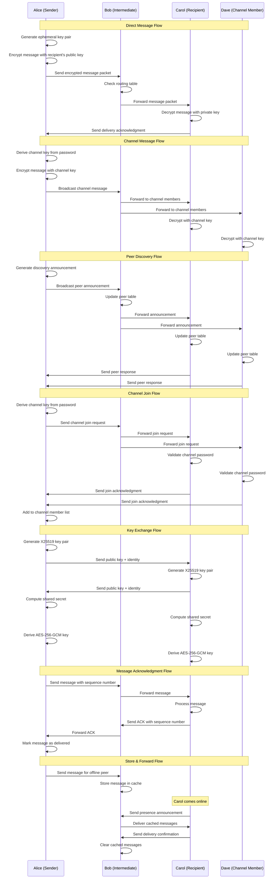

# BitChat Protocol - Message Flow Sequences



## Protocol Flow Details

### Message Types and Flows

#### 1. Direct Message (End-to-End Encrypted)
```
Sender → [Encrypt with recipient's public key] → Mesh Network → Recipient
```
- Uses X25519 key exchange for session keys
- AES-256-GCM for message encryption
- Ed25519 signatures for authentication

#### 2. Channel Message (Group Encrypted)
```
Sender → [Encrypt with channel key] → Broadcast → All Channel Members
```
- Channel key derived from password using Argon2id
- Messages broadcast to all known channel members
- Forward secrecy through periodic key rotation

#### 3. Peer Discovery
```
Node → [Broadcast announcement] → Mesh Network → [Update peer tables]
```
- Periodic announcements with node capabilities
- Exponential backoff for announcement frequency
- Peer table maintenance with TTL

#### 4. Channel Management
```
User → [Join/Leave request] → Channel Members → [Update membership]
```
- Password-based channel access control
- Distributed membership management
- Channel moderation capabilities

### Protocol States

#### Connection States
- **DISCONNECTED**: No BLE connections
- **SCANNING**: Actively discovering peers
- **CONNECTED**: Established BLE connections
- **MESH_ACTIVE**: Participating in mesh network

#### Message States
- **PENDING**: Message queued for transmission
- **SENT**: Message transmitted to mesh
- **DELIVERED**: Delivery confirmation received
- **FAILED**: Transmission failed after retries

#### Channel States
- **NOT_JOINED**: Not a member of channel
- **JOINING**: Join request in progress
- **JOINED**: Active channel member
- **LEAVING**: Leave request in progress

### Error Handling

#### Network Errors
- Connection timeouts trigger peer discovery
- Failed transmissions use exponential backoff
- Mesh partitions handled through store-and-forward

#### Cryptographic Errors
- Key exchange failures trigger renegotiation
- Decryption failures logged and ignored
- Invalid signatures cause message rejection

#### Protocol Errors
- Malformed packets are discarded
- Version mismatches trigger compatibility mode
- Rate limiting prevents spam attacks

### Performance Optimizations

#### Message Batching
- Multiple small messages combined into single packet
- Reduces BLE overhead and improves throughput
- Configurable batch size and timeout

#### Routing Optimization
- Shortest path routing with loop prevention
- Peer quality metrics for route selection
- Adaptive routing based on network conditions

#### Caching Strategy
- Recent messages cached for duplicate detection
- Peer information cached with TTL
- Channel membership cached locally