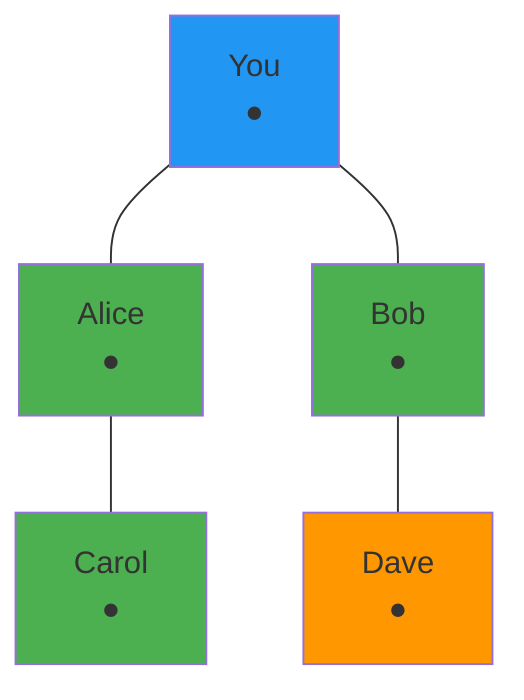

# BitChat Flutter - Peer Discovery Interface

## Peer Discovery Screen Layout

```
┌─────────────────────────────────────────────────────────────┐
│ ◀ Mesh Network                                    🔄 ⚙️    │ ← App Bar
├─────────────────────────────────────────────────────────────┤
│                                                             │
│ 📶 NETWORK STATUS                                           │
│                                                             │
│ ┌─────────────────────────────────────────────────────────┐ │
│ │ 🟢 Connected to Mesh                                    │ │
│ │ 4 peers • 2 hops to internet • Signal: Strong          │ │
│ │ Battery usage: 3% per hour                              │ │
│ └─────────────────────────────────────────────────────────┘ │
│                                                             │
│ 👥 DISCOVERED PEERS (4)                                    │
│                                                             │
│ ┌─────────────────────────────────────────────────────────┐ │
│ │ 👤 Alice                                    🟢 📶 ●●●●  │ │ ← Direct Connection
│ │ Node: a1b2c3d4 • Distance: Direct • RSSI: -45 dBm      │ │
│ │ Last seen: Just now                                     │ │
│ └─────────────────────────────────────────────────────────┘ │
│                                                             │
│ ┌─────────────────────────────────────────────────────────┐ │
│ │ 👤 Bob                                      🟢 📶 ●●●○  │ │ ← 1 Hop Away
│ │ Node: b2c3d4e5 • Distance: 1 hop • RSSI: -65 dBm       │ │
│ │ Last seen: 30 seconds ago                               │ │
│ └─────────────────────────────────────────────────────────┘ │
│                                                             │
│ ┌─────────────────────────────────────────────────────────┐ │
│ │ 👤 Carol                                    🟡 📶 ●●○○  │ │ ← 2 Hops Away
│ │ Node: c3d4e5f6 • Distance: 2 hops • RSSI: -78 dBm      │ │
│ │ Last seen: 2 minutes ago                                │ │
│ └─────────────────────────────────────────────────────────┘ │
│                                                             │
│ ┌─────────────────────────────────────────────────────────┐ │
│ │ 👤 Dave                                     ⚫ 📶 ●○○○  │ │ ← Poor Connection
│ │ Node: d4e5f6g7 • Distance: 3 hops • RSSI: -89 dBm      │ │
│ │ Last seen: 5 minutes ago                                │ │
│ └─────────────────────────────────────────────────────────┘ │
│                                                             │
│ 🗺️ NETWORK MAP                                              │
│                                                             │
│ ┌─────────────────────────────────────────────────────────┐ │
│ │                    [Network Topology]                   │ │
│ │                                                         │ │
│ │     You ●─────● Alice                                   │ │
│ │      │         │                                       │ │
│ │      │         │                                       │ │
│ │     Bob ●─────● Carol                                   │ │
│ │      │                                                 │ │
│ │     Dave ●                                              │ │
│ │                                                         │ │
│ └─────────────────────────────────────────────────────────┘ │
│                                                             │
└─────────────────────────────────────────────────────────────┘
```

## Scanning State

```
┌─────────────────────────────────────────────────────────────┐
│ ◀ Mesh Network                                    ⏸️ ⚙️    │ ← Pause Scanning
├─────────────────────────────────────────────────────────────┤
│                                                             │
│ 📡 SCANNING FOR PEERS...                                   │
│                                                             │
│ ┌─────────────────────────────────────────────────────────┐ │
│ │                    🔄 Scanning                          │ │
│ │                                                         │ │
│ │              Searching for nearby devices               │ │
│ │                                                         │ │
│ │                 ●●●○○○○○ (3/8 channels)                 │ │
│ │                                                         │ │
│ │                   [Stop Scanning]                       │ │
│ └─────────────────────────────────────────────────────────┘ │
│                                                             │
│ 📊 SCAN STATISTICS                                          │
│                                                             │
│ ┌─────────────────────────────────────────────────────────┐ │
│ │ Scan Duration: 00:02:15                                 │ │
│ │ Devices Found: 4                                        │ │
│ │ Connections Established: 2                              │ │
│ │ Battery Usage: 0.5%                                     │ │
│ └─────────────────────────────────────────────────────────┘ │
│                                                             │
└─────────────────────────────────────────────────────────────┘
```

## No Peers Found State

```
┌─────────────────────────────────────────────────────────────┐
│ ◀ Mesh Network                                    🔄 ⚙️    │
├─────────────────────────────────────────────────────────────┤
│                                                             │
│ 📶 NETWORK STATUS                                           │
│                                                             │
│ ┌─────────────────────────────────────────────────────────┐ │
│ │ 🔴 Not Connected                                        │ │
│ │ No mesh network found                                   │ │
│ └─────────────────────────────────────────────────────────┘ │
│                                                             │
│                                                             │
│                         📡                                 │
│                                                             │
│                   No Peers Found                            │
│                                                             │
│              Make sure Bluetooth is enabled                 │
│             and other BitChat users are nearby             │
│                                                             │
│                    [Start Scanning]                         │
│                                                             │
│                                                             │
│ 💡 TIPS                                                     │
│                                                             │
│ • Ask friends to open BitChat on their devices             │
│ • Move to a more open area                                  │
│ • Check that Bluetooth permissions are granted             │
│ • Ensure your device is discoverable                       │
│                                                             │
└─────────────────────────────────────────────────────────────┘
```

## Component Specifications

### Network Status Card
```dart
Card(
  child: Padding(
    padding: EdgeInsets.all(16),
    child: Column(
      crossAxisAlignment: CrossAxisAlignment.start,
      children: [
        Row(
          children: [
            Icon(
              Icons.circle,
              color: isConnected ? Colors.green : Colors.red,
              size: 12,
            ),
            SizedBox(width: 8),
            Text(
              isConnected ? 'Connected to Mesh' : 'Not Connected',
              style: Theme.of(context).textTheme.titleMedium,
            ),
          ],
        ),
        SizedBox(height: 8),
        Text(
          '$peerCount peers • $hopCount hops to internet • Signal: $signalStrength',
          style: Theme.of(context).textTheme.bodyMedium,
        ),
        Text(
          'Battery usage: $batteryUsage% per hour',
          style: Theme.of(context).textTheme.bodySmall,
        ),
      ],
    ),
  ),
)
```

### Peer List Item
```dart
ListTile(
  leading: CircleAvatar(
    backgroundColor: Theme.of(context).colorScheme.primaryContainer,
    child: Icon(Icons.person),
  ),
  title: Row(
    children: [
      Text(peer.name),
      Spacer(),
      Icon(
        Icons.circle,
        color: peer.isOnline ? Colors.green : Colors.grey,
        size: 12,
      ),
      SizedBox(width: 8),
      SignalStrengthIndicator(strength: peer.signalStrength),
    ],
  ),
  subtitle: Column(
    crossAxisAlignment: CrossAxisAlignment.start,
    children: [
      Text('Node: ${peer.nodeId} • Distance: ${peer.distance} • RSSI: ${peer.rssi} dBm'),
      Text('Last seen: ${formatLastSeen(peer.lastSeen)}'),
    ],
  ),
  onTap: () => showPeerDetails(peer),
)
```

### Signal Strength Indicator
```dart
Widget SignalStrengthIndicator({required int strength}) {
  return Row(
    mainAxisSize: MainAxisSize.min,
    children: List.generate(4, (index) {
      return Container(
        width: 4,
        height: 8 + (index * 2),
        margin: EdgeInsets.only(right: 1),
        decoration: BoxDecoration(
          color: index < strength 
            ? Theme.of(context).colorScheme.primary
            : Theme.of(context).colorScheme.outline,
          borderRadius: BorderRadius.circular(1),
        ),
      );
    }),
  );
}
```

## Network Topology Visualization

### Simple Network Map


### Interactive Network Map Widget
```dart
class NetworkMapWidget extends StatelessWidget {
  final List<Peer> peers;
  final List<Connection> connections;
  
  @override
  Widget build(BuildContext context) {
    return Container(
      height: 200,
      child: CustomPaint(
        painter: NetworkMapPainter(
          peers: peers,
          connections: connections,
        ),
        child: Container(),
      ),
    );
  }
}
```

## Peer Details Dialog

```
┌─────────────────────────────────────────────────────────────┐
│                      Peer Details                           │
├─────────────────────────────────────────────────────────────┤
│                                                             │
│ 👤 Alice                                                    │
│                                                             │
│ Node ID: a1b2c3d4e5f6g7h8                                  │
│ Status: 🟢 Online                                           │
│ Distance: Direct connection                                 │
│ Signal Strength: -45 dBm (Excellent)                       │
│ Last Seen: Just now                                         │
│ Connection Time: 00:15:32                                   │
│                                                             │
│ 🔒 SECURITY                                                 │
│ Encryption: ✅ AES-256-GCM                                  │
│ Key Exchange: ✅ X25519 ECDH                                │
│ Authentication: ✅ Ed25519                                  │
│                                                             │
│ 📊 STATISTICS                                               │
│ Messages Sent: 23                                           │
│ Messages Received: 18                                       │
│ Data Transferred: 2.3 KB                                    │
│ Average Latency: 45ms                                       │
│                                                             │
│                    [Send Message]    [Close]               │
└─────────────────────────────────────────────────────────────┘
```

## Advanced Features

### Mesh Network Settings
```
┌─────────────────────────────────────────────────────────────┐
│ ◀ Network Settings                                          │
├─────────────────────────────────────────────────────────────┤
│                                                             │
│ 📡 SCANNING                                                 │
│                                                             │
│ ┌─────────────────────────────────────────────────────────┐ │
│ │ Auto-Scan                                      ✓        │ │
│ │ Automatically scan for new peers                        │ │
│ └─────────────────────────────────────────────────────────┘ │
│                                                             │
│ ┌─────────────────────────────────────────────────────────┐ │
│ │ Scan Interval                               30s ▶       │ │
│ │ How often to scan for new peers                         │ │
│ └─────────────────────────────────────────────────────────┘ │
│                                                             │
│ ┌─────────────────────────────────────────────────────────┐ │
│ │ Scan Duration                               10s ▶       │ │
│ │ How long each scan lasts                                │ │
│ └─────────────────────────────────────────────────────────┘ │
│                                                             │
│ 🔗 CONNECTIONS                                              │
│                                                             │
│ ┌─────────────────────────────────────────────────────────┐ │
│ │ Max Connections                              8 ▶        │ │
│ │ Maximum simultaneous peer connections                   │ │
│ └─────────────────────────────────────────────────────────┘ │
│                                                             │
│ ┌─────────────────────────────────────────────────────────┐ │
│ │ Connection Timeout                          30s ▶       │ │
│ │ Time to wait for peer responses                         │ │
│ └─────────────────────────────────────────────────────────┘ │
│                                                             │
└─────────────────────────────────────────────────────────────┘
```

## State Management

### Peer Discovery State
```dart
class PeerDiscoveryState {
  List<Peer> discoveredPeers;
  bool isScanning;
  bool isConnected;
  NetworkStatus networkStatus;
  ScanStatistics scanStats;
  List<Connection> connections;
  Duration scanDuration;
  int batteryUsage;
}

class Peer {
  String id;
  String name;
  String nodeId;
  bool isOnline;
  int distance; // hops
  int signalStrength; // 0-4 bars
  double rssi; // dBm
  DateTime lastSeen;
  Duration connectionTime;
  PeerStatistics stats;
  SecurityInfo security;
}

class NetworkStatus {
  bool isConnected;
  int peerCount;
  int hopCount;
  String signalQuality;
  double batteryUsagePerHour;
}
```

### Scanning Logic
```dart
class PeerDiscoveryService {
  Stream<List<Peer>> scanForPeers() async* {
    while (isScanning) {
      final scanResults = await bluetoothService.scan(
        duration: scanDuration,
        serviceUuids: [BitChatService.uuid],
      );
      
      final peers = await Future.wait(
        scanResults.map((result) => processScanResult(result)),
      );
      
      yield peers.where((peer) => peer != null).cast<Peer>().toList();
      
      await Future.delayed(scanInterval);
    }
  }
  
  Future<Peer?> processScanResult(ScanResult result) async {
    try {
      final advertisementData = parseAdvertisementData(result.advertisementData);
      
      return Peer(
        id: advertisementData.nodeId,
        name: advertisementData.displayName,
        rssi: result.rssi.toDouble(),
        signalStrength: calculateSignalStrength(result.rssi),
        lastSeen: DateTime.now(),
      );
    } catch (e) {
      return null;
    }
  }
}
```

## Accessibility Features

### Screen Reader Support
```dart
Semantics(
  label: 'Peer ${peer.name}',
  hint: 'Signal strength ${peer.signalStrength} out of 4, distance ${peer.distance} hops',
  child: PeerListItem(peer: peer),
)
```

### High Contrast Mode
- Enhanced contrast for signal strength indicators
- Bold text for peer names and status
- Clear visual separation between peers
- Alternative icons for connection states

## Performance Optimizations

### Efficient Scanning
- Adaptive scan intervals based on battery level
- Background scanning with reduced frequency
- Smart filtering to avoid duplicate discoveries
- Connection pooling for better resource usage

### UI Optimizations
- Virtual scrolling for large peer lists
- Debounced updates to prevent UI jank
- Efficient state management with proper disposal
- Cached network topology calculations

This peer discovery interface provides comprehensive visibility into the mesh network while maintaining an intuitive user experience and efficient resource usage.